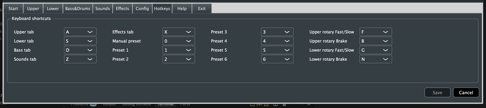
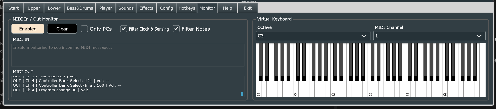
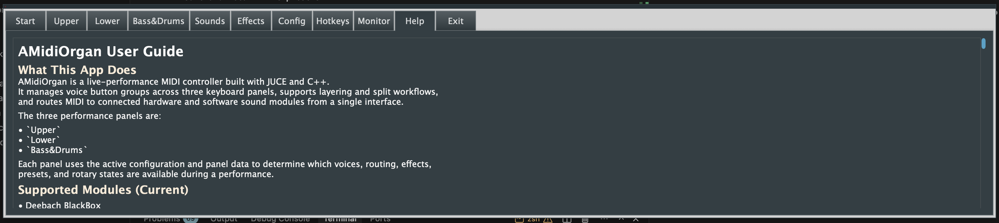

# AMidiOrgan Features

AMidiOrgan is a live-performance MIDI controller built with [JUCE](https://juce.com). It is designed for rigs with multiple MIDI keyboards and sound modules, bringing routing, layering, preset recall, voice editing, and effect control into one interface.

  
What problem does AMIDIOrgan solve:

- If when you have more than keyboard, organ or sound module in your gig, then for each performance you have to configure the keyboard and modules seperately for the voices you plan to use.
- If is challenging to change the configuration of multipe decives at the same time. The 12 presets available in the solution can be configured to voice changes across all devices and will change it synchronously.
- Voice layering is supported across one or multiple devices, along with assignable keyboard splits on the Upper and Lower keyboards. 
- The MIDI implementation for each device is loaded into the solution, tied to a device module that is configured on each button group. This enables you to configure voice buttons for each of the MIDI devices in the Sounds tab.
- Multiple MIDI keyboards and sound modules can be interfaced via USB directly in eg. the host Mac or Windows machine. This  simplifies the configuration and often you may be able to get buy without external MIDI hardware mergers or routers.
- OS supported hotkeys for key functions have been integrated into the AMIDIOrgan. This means that you can use an external keypad or a Streamdeck to trigger the hotkey supported functions.

For complete end-user operating instructions (installation, setup, and screen-by-screen usage), see [USER_MANUAL.md](USER_MANUAL.md).

For architecture and implementation details, see [TECHNICAL_OVERVIEW.md](TECHNICAL_OVERVIEW.md).

The application is organized around three performance panels (tabs) plus a number of supporting tabs:
- `Upper`
- `Lower`
- `Bass&Drums`

Instrument panels use the active configuration and panel data to determine which features such as voices, routing, effects, presets, and rotary states are available during a performance. Multiple panels can be configured and panel each can represent registrations sucb as:
- music style (jazz, rock, classical, etc) for casual play and quick recall of your favorite voices across multiple sound modules, 
- song-specific (one or more songs).

## UI Screenshots

### Start Tab


### Upper Tab


### Lower Tab


### Bass Tab


### Sounds Tab


### Effects Tab


### Config Tab


### Hotkeys Tab



### Monitor Tab



### Help Tab



## Functional Overview

Supported MIDI hardware and software sound modules:
- Deebach BlackBox
- Roland Integra7
- Roland AT-900
- Ketron EVM
- MIDI GM / Custom GM
- Contact developer for additional module support.

### 1. Startup Flow

1. Open the `Start` tab.
2. Select MIDI input and output devices.
3. Select the active sound module using `To Modules`.
4. Load a panel (`.pnl`) and config (`.cfg`) if needed, or create a fresh panel from the current module using `New Panel`.
5. Confirm the panel and config labels match what you expect.
6. Move to `Upper`, `Lower`, or `Bass&Drums` and begin playing.

On startup, the app also attempts to auto-restore the last used panel and config when those files still exist.

### 2. Tab Guide

#### Start

- Lists MIDI input and output devices and updates as devices connect or disconnect.
- Your selected MIDI In and Out ports are remembered across launches (`Documents/AMidiOrgan/configs/midi_sticky_devices.json`, by JUCE device identifier).
- Lets you choose the active sound module.
- Loads panel and config files.
- `New Panel` creates a new `.pnl` from the currently selected module:
  - all voice buttons are initialized to the first voice in that module list
  - you are prompted for a new file name in a save-style dialog
  - duplicate file names are blocked with a warning (no overwrite)
  - on successful save, the new panel is loaded immediately (same flow as `Load Panel`)
- On launch, restores last used panel/config when available (`Documents/AMidiOrgan/configs/last_session.json`).
- Checks config and panel pairing when loading, and can warn if the selected files do not belong together.
- Includes a quick `Exit` button in the Start action row (next to keyboard navigation).
- Start status lines render as `Panel: <file>` and `Config: <file>` with tight one-space formatting.

#### Upper / Lower / Bass&Drums

- These are the main performance tabs.
- Each tab contains voice button groups, volume controls, mute, and preset recall.
- `Upper` and `Lower` also include rotary controls.
- `Save` and `Save As` write the current panel (`.pnl`) to disk.
- The preset buttons are shared across all three keyboard tabs.
- The `Voice Edits` row (`Sounds` / `Effects`) is enabled after selecting a voice button.
- Risk warning: the `Effects` button turns orange when the selected voice has `VOL`, `EXP`, or `BRI` set to `0` (which can result in no audible sound).

#### Sounds

- Assigns an instrument voice to the currently selected voice button.
- Select the target voice button on a keyboard tab before opening `Sounds`.
- Browse in two levels inside the `Voice Button Config` area:
  - Level 1: voice category buttons (for example `A-Piano`, `E-Piano`, `Organ`)
  - Level 2: voice buttons in the selected category
- Use the `Voice Search` box (right side) to filter voices across all categories.
- Search is case-insensitive substring matching (for example `sax`).
- While search text is present, the browser becomes `Search Results` and lists matching voices as `Voice (Category)`.
- Clearing search text restores normal category browsing.
- The group title is prefixed with the active sound module name when available.
- Clicking a voice sends MSB/LSB/PC immediately on the button group's MIDI output channel for audition.
- `Back` returns from Level 2 to Level 1.
- `Prev` / `Next` paginate categories or voices when the list exceeds visible space.
- Use `To Upper`, `To Lower`, or `To Bass` to return to the performance tab.

#### Effects

- Edits per-voice MIDI effect values in real time.
- Select the target voice button on a keyboard tab before opening `Effects`.
- The group title is prefixed with the active sound module name when available.
- Effect changes are applied on the button group's MIDI output channel as you edit them.
- Use `To Upper`, `To Lower`, or `To Bass` to return to the performance tab.
- The following MIDI effects that can be changed on each voice button:
  - VOL, EXP, REV, CHO, MOD
  - TIM, ATK, REL, BRI, PAN

#### Config

- Edits button group routing and behavior:
  - group name
  - MIDI In / Out channel
  - octave shift
  - solo split point for Upper / Lower
- `MIDI Reset` sends a controller reset on all 16 channels.
- `MIDI In Passthru` is a global input-channel filter, not a per-device or per-output setting.
- When it is **ON**, all incoming MIDI channels are allowed through.
- When it is **OFF**, only MIDI input channels assigned to button groups are allowed through; other incoming channels are blocked.
- MIDI channel `16` is still allowed for controller-style traffic even when pass-through is off.
- `Startup Monitor` is a global config option saved in the `.cfg` file.
- When `Startup Monitor` is **ON**, outgoing MIDI monitoring is enabled automatically during startup so initialization traffic can be reviewed later in the `Monitor` tab.
- Startup auto-enable does **not** switch the visible tab; the app continues normal startup and you open `Monitor` manually when needed.
- `UI Profile` selects a fixed-size UI layout profile (currently `1480x320` and `2560x720`).
- Changing `UI Profile` applies live to Start/Upper/Lower/Bass/Config/Sounds/Effects/Hotkeys/Monitor and also resizes the app window to the selected profile dimensions.
- Profile catalog file is `Documents/AMidiOrgan/configs/ui_profiles.json`.
- `Export UI Map` writes a ready-to-edit snapshot file:
  - `Documents/AMidiOrgan/configs/ui_profile_overrides_<profileId>.json`
  - currently includes `keyboardRectOverrides` entries with control ids (for example `kbd.upper.`*) and current bounds.
- Profile overrides in `ui_profiles.json`:
  - `keyboardRectOverrides`: absolute `x/y/w/h` per keyboard-tab control id.
  - `startRectOverrides`: absolute `x/y/w/h` per Start-tab control id.
  - `configRectOverrides`: absolute `x/y/w/h` per Config-tab control id.
  - `fontScaleOverrides`: per-control font scale multiplier (`0.5..4.0`) by control id.
- Control-type baseline scales remain available per profile (`buttonFontScale`, `labelFontScale`, `toggleFontScale`, `comboFontScale`).
- Override precedence: explicit `keyboardRectOverrides`, `startRectOverrides`, `configRectOverrides`, and `fontScaleOverrides` in your `ui_profiles.json` win over built-in defaults shipped by the app.
- `Preset MIDI PC` is a global config trigger for preset-next automation:
  - `Input Channel` (`1..16`, default `16`)
  - `PC Value` (`0..127`, default `0`)
  - When a matching incoming Program Change is received, it triggers `Next preset` using the same path as the `Next preset` hotkey.
  - Matching Program Change is consumed (not forwarded to MIDI outputs), and this match check is independent of `MIDI In Passthru`.
- Solo split note names use the project-wide `C4 = 60` convention.
- **Default Effects** fields (Vol, Bri, Exp, Rev, Cho, Mod, Tim, Atk, Rel, Pan) set starting MIDI CC values for new voice assignments (Sounds tab route and fresh panel initialization). They are saved in the config file. Defaults match a new `Instrument`: Vol 100, Bri 30, Exp 127, Rev 20, Cho 10, Mod/Tim/Atk/Rel 0, Pan 64. Each field accepts **0–127** only (digits-only entry; invalid or out-of-range values are rejected on focus loss). Volume scaling still treats a default Vol of **0** like **1** when computing effective CC7.
- Re-using the same **MIDI Out channel** across button groups that target different sound modules is supported: that output channel fans out to each mapped module.
- Saving config is blocked if two or more button groups share the same **MIDI sound module** and the same **MIDI Out channel** (duplicate module/channel entries are treated as redundant/ambiguous and must be unique).
- Config settings are global to the app and are separate from the currently loaded panel.

#### Hotkeys

- Lets you assign keyboard shortcuts for tabs, presets, and rotary controls.
- Available values are `A-Z`, `0-9`, and `(None)`.
- `Save` applies the current shortcut map and writes it to disk.
- `Cancel` restores the last applied shortcut map.
- Duplicate non-empty shortcuts are blocked.
- Next preset shortcut is also supported via a programmable Program Change.

#### Monitor

- Shows outgoing MIDI messages in a live monitor view.
- Capture is controlled by the `Enable` button and remains active globally while enabled.
- If Config `Startup Monitor` is enabled, capture also starts automatically during app startup before the user opens the `Monitor` tab.
- `Clear` clears the visible monitor history.
- Each line includes routed channel/message details and the routed sound module name.
- The Monitor tab includes a virtual MIDI keyboard and an `Octave` control for range positioning.
- Monitor note names and keyboard labels now follow the same `C4 = 60` convention used by Solo split values in Config.

#### Player

- `Scale file CCs with Player strip` is an optional playback-time merge in the `Player` tab.
- Merge is active only for channels that are explicitly configured from `Player` (`Ch 1..16` voice button selected at least once).
- Merge runs during MIDI-file playback after Player channel Program/Bank substitution and before the generic Program Change remap lookup path.
- When enabled, file CC values are scaled by the channel strip value using:
  - `merged = clamp(round(fileValue * stripValue / 127.0))`
- The following file CCs are scaled: `CC1`, `CC7`, `CC11`, `CC71`, `CC72`, `CC73`, `CC74`, `CC91`, `CC93`.
- `CC10` (`Pan`) is intentionally passed through unchanged during this merge mode to avoid incorrect left/right behavior from naive 0..127 scaling around pan center.
- Non-controller MIDI events continue through the normal playback path unchanged.
- Player now supports per-song profile workflows:
  - `Apply Profile` selector + `Save Profile`, `Save Profile As`, `Revert Profile`, and `Load MIDI+Profile`.
  - Profiles are sidecar data (the `.mid` file is not rewritten during normal playback).
  - Profiles capture per-channel voice/effect strips, configured-channel flags, module selection, mute/solo state, and Player remap/merge toggles.
  - `Load MIDI+Profile` uses the selected profile's saved MIDI path, loads that MIDI file into Player, and then applies that exact profile.
  - Missing/invalid MIDI path in a profile is reported in Player status and the current session is left unchanged.
  - Profile files are stored under `Documents/AMidiOrgan/configs/player_profiles/`.
  - Profile index and last-used mapping are stored in `Documents/AMidiOrgan/configs/player_profiles_index.json`.

#### Help

- Shows the embedded user guide.

#### Exit

- Exits the application.
- If panel-related changes are pending, the app may ask whether you want to save before quitting.
- Start-tab `Exit` button triggers the same exit flow as the `Exit` tab.

### 3. Voice Buttons

- Each voice button stores a MIDI instrument sound from the active device or module.
- Each button also stores its own MIDI effect values, so two buttons in the same group can sound and behave differently.

### 4. Voice Button Groups

- A voice button group is a logical set of related voice buttons.
- Group layout and routing are configured in the `Config` tab.
- Each group stores:
  - MIDI In and Out settings
  - octave shift
  - solo split settings for Upper or Lower
- Every group has a volume slider with Up / Down controls.
- Volume slider, Up/Down, and Mute send MIDI on the group's **current** MIDI Out channel (after loading or saving Config), not a channel frozen at app startup.
- Group volume changes are for live balancing and are not written back into the active voice button's stored instrument volume value.

#### Mute and Layering

- Muting is used for fast live layering control.
- When a group is muted, its volume slider and Up / Down controls are disabled.
- While muted, new MIDI Note On and Note Off events are blocked for that group's output channel (hard mute).
- On mute, the app sends cleanup controllers to that output channel:
  - Sustain Off (`CC64=0`)
  - All Notes Off (`CC123=0`)
- Mute does not send `CC7=0`; channel volume is restored by the normal volume path on unmute.
- The first button group In channel forwards all MIDI messages directly to its Out channel by default.
- Layering to groups 2, 3, and 4 forwards Note On and Note Off using the active voice button's sound and effects.

### 5. Instrument Panels

- The system uses one instrument panel containing:
  - Upper keyboard panel
  - Lower keyboard panel
  - Bass&Drums keyboard panel
- Panels can be created by organ style, by setup, or by song.
- A panel can contain up to 96 voice buttons across 12 button groups.
- Panel save (`.pnl`) stores:
  - all voice button values
  - button group details
  - 13 preset configurations (`Manual` + `Preset 1..12`)
- Button groups are color-coded by keyboard panel.

### 6. Presets

- There are 13 presets in total:
  - `Manual`
  - Presets `1` to `12` (displayed in two banks of six)
- `Manual` is the default preset on startup.
- The UI keeps six numbered preset buttons visible at a time:
  - Default bank: `Preset 1` to `Preset 6`
  - Alternate bank: `Preset 7` to `Preset 12`
- `Next` cycles numbered presets as `1 -> ... -> 6 -> 7 -> ... -> 12 -> 1`.
- If `Manual` is active, `Next` recalls the first preset in the currently displayed bank (`1` or `7`).
- Panel load remains backward compatible with older files that contain only `Manual + Preset 1..6`; missing `Preset 7..12` entries are initialized to defaults.
- Each preset stores the active voice button in each button group across all three keyboard tabs.
- Each preset also stores per-button-group rotary snapshot values used during preset recall.
- Preset programming flow:
  - Select the target preset.
  - Adjust the active voice buttons as needed across panels.
  - Click `Preset Set`, then click the preset button again to write the snapshot.
- Changing the Upper or Lower rotary controls also updates the active preset's stored rotary state.
- Save the panel if you want preset changes to persist to disk.

### 7. Rotary

- Rotary controls are available on `Upper` and `Lower`.
- Rotary supports `Fast/Slow` and `Brake`.
- Each manual has a `Rotary` selector checkbox in Button Group 1 and Button Group 2 (inside each group border, lower-left area below row 2 voice 1).
- Exactly one selector is active per manual:
  - Group 1 checked routes rotary to that manual's first group.
  - Group 2 checked routes rotary to that manual's second group.
- Changing the selector immediately rebinds rotary MIDI route and module behavior (including type-specific implementation) to the selected group.
- Switching between `Upper`, `Lower`, and `Bass&Drums` refreshes the rotary controls from saved manual state without sending extra MIDI on tab change.
- Upper and Lower manual rotary states, including the selected rotary target group (1 or 2), are saved with the panel.
- Presets also store per-group rotary values for recall.

### 8. Config and Panel Save Behavior

- Config settings apply globally to the app and are separate from the currently loaded panel.
- Changing `Startup Monitor` is treated like any other Config edit and marks Config `Save` / `Save As` as pending until written.
- Panels and configs are related: a panel stores the config name it expects.
- If you load a panel and config that do not match, the app can warn and let you abort or continue.
- While a config and panel mismatch is acknowledged, normal panel `Save` may stay disabled until the relationship is resolved.
- `Save As` can be used to write a new panel that matches the current config.
- If you change a sound module assignment inside a config that other panels depend on, saving that same config name may be blocked so older panels are not silently broken.
- Duplicate **module + MIDI Out channel** across button groups is detected on config save and blocks the write until fixed.
- Each button group can optionally forward SysEx by enabling `SysEx Through` and selecting a `SysEx Input` device identifier on the Config tab.
- Each button group now includes `Global CC Through` (default OFF). For inbound MIDI **CC** on channel `16`, AMidiOrgan evaluates all 12 groups and forwards CC only for groups where this toggle is ON.
- Channel-16 CC forwarded by `Global CC Through` remains on channel `16` (no channel rewrite). If multiple enabled groups target the same physical MIDI OUT device, duplicate sends are expected by design (one send per enabled group).

### 9. File Locations

AMidiOrgan stores user data under:

- `Documents/AMidiOrgan`

Important subfolders:

- `configs/` for `.cfg` files
- `configs/instrument_modules.json` for module labels and MIDI output device match aliases (`matchStrings`)
- `panels/` for `.pnl` files
- `instruments/` for JSON instrument catalogs
- `configs/hotkeys.json` for keyboard shortcut bindings

`SysEx Through` settings are stored inside each config `.cfg` as per-group values (`sysexThrough`, `sysexInputIdentifier`).
`Global CC Through` is also stored per group in `.cfg` (`globalCcThrough`, bool, default `false` when missing in older configs).

### 10. Keyboard Shortcuts (Phase 1)

When the main window has focus:


| Action                   | Key       |
| ------------------------ | --------- |
| Preset 1–6               | `1`–`6`   |
| Manual preset            | `0`       |
| Next preset              | `7`       |
| Upper / Lower / Bass tab | A / S / D |
| Sounds tab               | Z         |
| Effects tab              | X         |
| Monitor tab              | M         |
| Upper rotary Fast/Slow   | F         |
| Upper rotary Brake       | B         |
| Lower rotary Fast/Slow   | G         |
| Lower rotary Brake       | N         |


Upper and Lower rotary keys always target their respective manuals, even when another tab is selected.

### Editing Shortcuts

Use the `Hotkeys` tab (between `Config` and `Monitor`) to assign each command to a key from `A-Z` or `0-9`, or `(None)` for no mapping. `Save` writes `Documents/AMidiOrgan/configs/hotkeys.json` and applies the mapping; the app also loads that file on startup. If two or more commands share the same non-empty key, `Save` is blocked and a warning is shown. `Cancel` discards unsaved edits in the tab and restores the last applied bindings.

Current preset hotkeys cover `Manual`, `Preset 1..6`, and `Next preset`. Dedicated hotkeys for `Preset 7..12` are not defined.

While a `TextEditor` or `ComboBox` has keyboard focus, including inside modal dialogs, global shortcuts are deferred so normal typing and selection still work.

Letter shortcuts may still fire when focus is on other controls, such as a plain button.

## 12. Build

### Prerequisites

- CMake 3.22 or newer
- JUCE source checkout (for example: `C:/JUCE` on Windows or `./.deps/JUCE` in this repo on macOS)
- macOS builds: Xcode + Command Line Tools

### Windows (Visual Studio generator)

If JUCE is checked out at `C:/JUCE`, you can omit `-DJUCE_ROOT`; CMake will pick that path automatically. Otherwise pass `-DJUCE_ROOT` to your JUCE root (the folder that contains JUCE’s top-level `CMakeLists.txt`), or set the `JUCE_ROOT` environment variable to the same path.

From the repository root:

```powershell
cmake -S . -B build -DJUCE_ROOT="C:/JUCE"
cmake --build build --config Debug --target AMidiOrgan
```

Output executable:

- `build/AMidiOrgan_artefacts/Debug/AMidiOrgan.exe`

### Run (Windows)

From the repository root:

```powershell
# Run Debug build in a new process
Start-Process "build/AMidiOrgan_artefacts/Debug/AMidiOrgan.exe"

# Optional: run in the current terminal (foreground)
& "build/AMidiOrgan_artefacts/Debug/AMidiOrgan.exe"
```

To run Release:

```powershell
cmake --build build --config Release --target AMidiOrgan
Start-Process "build/AMidiOrgan_artefacts/Release/AMidiOrgan.exe"
```

### Build Version Metadata (Start tab + title bar)

The app shows two build metadata values:

- `Version` (`AMIDIORGAN_PROJECT_VERSION`) comes from `project(AMidiOrgan VERSION x.y.z ...)` in `CMakeLists.txt`.
- `Build` (`AMIDIORGAN_BUILD_NUMBER`) comes from `git rev-parse --short=8 HEAD` during CMake configure/generate.

Update behavior:

- `Version` changes only when you edit the `VERSION` value in `CMakeLists.txt`, then rebuild.
- `Build` SHA updates when CMake configure runs; a plain `cmake --build ...` may reuse a previous configured SHA if reconfigure is not triggered.

To force-refresh the displayed SHA before a build:

```powershell
cmake -S . -B build
cmake --build build --config Release --target AMidiOrgan
```

### Test (Windows)

From the repository root:

```powershell
# Build the test executable
cmake --build build --config Debug --target AMidiOrganTests

# (Optional) Regenerate deterministic multi-channel fixture
python tools/generate_amtest_midi.py

# Run tests
ctest --test-dir build -C Debug --output-on-failure
```

The test suite now includes `amtest.mid` playback coverage:

- Fixture file: `docs/midi/amtest.mid`
- Generator script: `tools/generate_amtest_midi.py`
- Test name in output: `amtest.mid playback emits all channels and expected note pattern`

To run the executable directly and filter that one line from output:

```powershell
.\build\AMidiOrganTests_artefacts\Debug\AMidiOrganTests.exe 2>&1 | Select-String "amtest.mid playback emits all channels and expected note pattern"
```

### Continuous Integration (GitHub Actions)

- Workflow file: `.github/workflows/ci.yml`
- Triggers: push to `main`, pull requests targeting `main`, and manual dispatch.
- Platforms: `windows-latest` and `macos-latest`.
- Pipeline steps:
  - Configure CMake using a checked-out JUCE source tree.
  - Build `AMidiOrganTests`.
  - Run `ctest`.
  - Build `AMidiOrgan` (Debug build on both platforms).
- Current regression tests cover utility bounds, MIDI split/layer routing (including shared-output-channel fan-out to multiple modules), preset/config persistence roundtrips, MIDI controller reset emission, deterministic MIDI fixture playback coverage across channels 1..16 (`amtest.mid`), shutdown-ownership crash paths, shortcut focus deferral (text fields vs global hotkeys), and hotkey duplicate detection rules.

### Recommended Manual UI Smoke Test

After a successful build, run this quick checklist (5-10 minutes):

1. Launch the app and open each tab once:
  - `Start`, `Upper`, `Lower`, `Bass&Drums`, `Sounds`, `Effects`, `Config`, `Hotkeys`, `Monitor`, `Help`.
2. On `Start`:
  - Load a config file.
  - Load a panel file.
  - Create a new panel via `New Panel`, verify it auto-loads.
  - Try creating the same panel name again and verify duplicate warning/no overwrite.
  - Confirm panel/config labels update and mismatch coloring behaves as expected.
3. On `Upper`, `Lower`, and `Bass&Drums`:
  - Click several voice buttons and confirm active-state behavior.
  - Use panel `Save` and `Save As`, then reload the saved panel.
4. On `Sounds` and `Effects`:
  - Change a voice and a few effect values.
  - Return to a keyboard tab and confirm state is preserved.
  - Confirm the keyboard-tab `Effects` shortcut button turns orange if the selected voice has `VOL`, `EXP`, or `BRI` set to `0`.
5. On `Monitor`:
  - Toggle `Enable` on and confirm outgoing MIDI traffic is appended.
  - Toggle `Enable` off and confirm history remains visible.
  - Click `Clear` and confirm the monitor view is cleared.
6. On `Config`:
  - Change one mapping value, save, reload, and confirm it persists.
  - Click into a text field and type digits/letters; confirm **global shortcuts do not** change tabs or presets while typing. Click the tab bar or an empty area, then confirm shortcuts work again.
7. If MIDI hardware is connected:
  - Open/close MIDI input and output devices and confirm no crash/hang.

### macOS (Xcode generator)

From the repository root:

```bash
# Optional one-time JUCE checkout (matches CI source-based flow)
mkdir -p .deps
git clone --depth 1 https://github.com/juce-framework/JUCE.git .deps/JUCE

# Configure, build tests, run ctest, and build app
cmake -S . -B build-mac -G Xcode -DJUCE_ROOT="$PWD/.deps/JUCE"
cmake --build build-mac --config Debug --target AMidiOrganTests
ctest --test-dir build-mac -C Debug --output-on-failure
cmake --build build-mac --config Debug --target AMidiOrgan
```

Typical output app bundle:

- `build-mac/AMidiOrgan_artefacts/Debug/AMidiOrgan.app`

### macOS Quick Start (Mac mini)

Step-by-step command-line guide for a clean Mac (Makefile vs Xcode, `ctest` notes): [MacMinibuild.md](MacMinibuild.md). **Bash automation:** `scripts/mac-bootstrap.sh` (first-time + deps) and `scripts/mac-build.sh` (repeat builds); see MacMinibuild §9.

Use this as the repeatable baseline on a dedicated macOS build machine:

```bash
# 1) Clone and enter repo
git clone https://github.com/aminnie/AMidiOrganOrg.git
cd AMidiOrganOrg

# 2) (One time) Get JUCE source locally
mkdir -p .deps
git clone --depth 1 https://github.com/juce-framework/JUCE.git .deps/JUCE

# 3) Configure + build
cmake -S . -B build-mac -G Xcode -DJUCE_ROOT="$PWD/.deps/JUCE"
cmake --build build-mac --config Debug --target AMidiOrgan

# 4) Optional tests
cmake --build build-mac --config Debug --target AMidiOrganTests
ctest --test-dir build-mac -C Debug --output-on-failure

# 5) Run app bundle
open build-mac/AMidiOrgan_artefacts/Debug/AMidiOrgan.app
```

Recommended upkeep on a Mac mini:

- Run `git fetch --prune` periodically.
- Keep builds in `build-mac` only (avoid mixing generators in one build dir).
- If something looks stale, remove `build-mac` and reconfigure from scratch.

### Notes

- UI images are packaged from `assets/*.png` via `juce_add_binary_data(...)` in `CMakeLists.txt`.
- On macOS, `docs/` is copied into `AMidiOrgan.app/Contents/Resources/docs` during build so first-run data seeding works when launching the bundle outside the repo tree.
- On Windows, `docs/` is copied next to `AMidiOrgan.exe` at build time for the same reason (portable or install layout should keep that folder beside the executable).
- On startup, the app seeds `Documents/AMidiOrgan` from `docs/` on first run, then ensures missing files under `configs/`, `instruments/` (JSON instrument catalogs), and `panels/` (`.pnl` panel files) are restored on subsequent runs.
- Managed startup sync also overwrites selected shipped files every launch to keep runtime data current: `configs/instrument_modules.json` and module catalogs `midigm.json`, `maxplus.json`, `integra7.json`, `at900mi.json`, `ketronevm.json`.
- User-editable catalogs such as `custom.json` are not part of the managed overwrite set.
- On macOS, the current test executable is compiled but runtime execution is temporarily disabled in CTest due a shutdown-time crash; app build validation remains fully enabled.

### Asset Naming Contract

The following asset filenames are referenced by code through `BinaryData` symbols and should remain stable unless code and CMake are updated together:

- `assets/keyboard.png`
- `assets/icons8arrowdown32.png`
- `assets/icons8arrowup32.png`
- `assets/icons8arrowdown32click.png`
- `assets/icons8arrowup32click.png`

### 13. General

- Built using JUCE and C++.
- Application can be compiled for multiple operating systems and devices.
- Current CI validates Windows and MacOS builds.
- Touch panel is supported; mouse/keyboard navigation is optional.

### 14. Device Support

- MIDI keyboards:
  - Every button group supports MIDI keyboard input and/or shared MIDI In.
  - For dedicated solo keyboard input, set split value to `0` for MIDI Out.
- Sound modules:
  - Uses custom JSON sound-module device files.
  - Supports hardware/software modules that present as MIDI devices after module file is added.
- Displays:
  - Screen profiles user selectable for
    - Waveshare 11.9" capacitive touch screen (1480x320)
      - [Waveshare 11.9" HDMI LCD](https://www.waveshare.com/11.9inch-hdmi-lcd.htm)
    - Corsair Xenon Edge 14.5" touch screen or equivalent (2560x720)
      - [https://www.corsair.com/us/en/p/monitors/cc-9011306-ww/xeneon-edge-14-5-lcd-touchscreen-cc-9011306-ww](https://www.corsair.com/us/en/p/monitors/cc-9011306-ww/xeneon-edge-14-5-lcd-touchscreen-cc-9011306-ww)

- App window size follows the selected UI profile.
- Application auto-centers on typical HD 15.6" displays.
- Contact the developer for additional display requests.

### 15. Up Next

- Use JUCE to compile/test controller with Raspberry Pi
  - Goal: cost-effective standalone controller + display without requiring a PC.
- Add optional hardware support for hotkey/buttons and sliders, e.g. Elgato Streamdeck or custom built

## Contact Details

- Anton Minnie: `a_minnie@hotmail.com`

