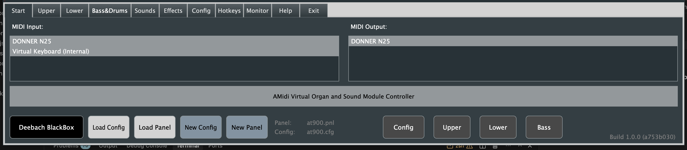
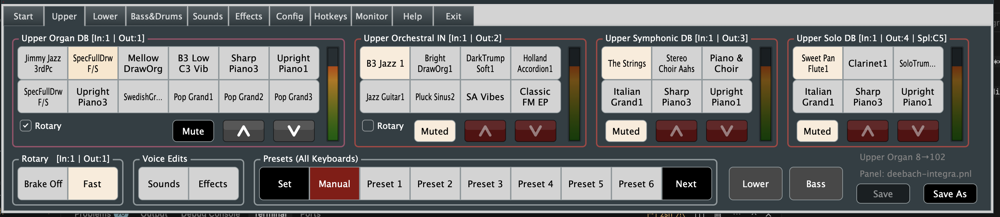
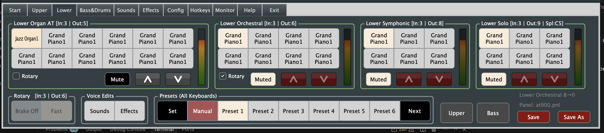
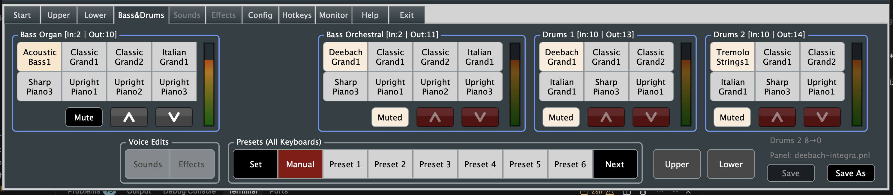
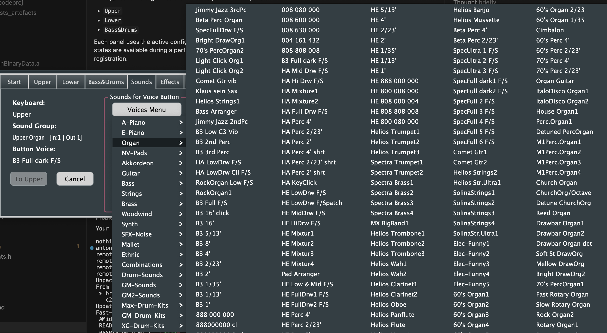
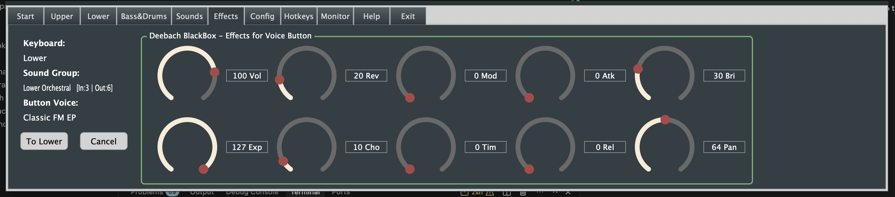
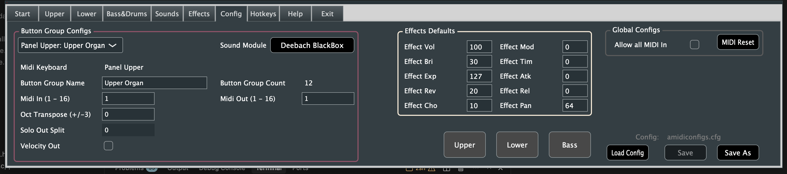

# AMidiOrgan Features

## Build

### Prerequisites

- CMake 3.22 or newer
- JUCE source checkout (for example: `C:/JUCE` on Windows or `./.deps/JUCE` in this repo on macOS)
- macOS builds: Xcode + Command Line Tools

### Windows (Visual Studio generator)

From the repository root:

```powershell
cmake -S . -B build -DJUCE_ROOT="C:/JUCE"
cmake --build build --config Debug --target AMidiOrgan
```

Output executable:

- `build/AMidiOrgan_artefacts/Debug/AMidiOrgan.exe`

### Run (Windows)

From the repository root:

```powershell
# Run Debug build in a new process
Start-Process "build/AMidiOrgan_artefacts/Debug/AMidiOrgan.exe"

# Optional: run in the current terminal (foreground)
& "build/AMidiOrgan_artefacts/Debug/AMidiOrgan.exe"
```

To run Release:

```powershell
cmake --build build --config Release --target AMidiOrgan
Start-Process "build/AMidiOrgan_artefacts/Release/AMidiOrgan.exe"
```

### Test (Windows)

From the repository root:

```powershell
# Build the test executable
cmake --build build --config Debug --target AMidiOrganTests

# Run tests
ctest --test-dir build -C Debug --output-on-failure
```

### Continuous Integration (GitHub Actions)

- Workflow file: `.github/workflows/ci.yml`
- Triggers: push to `main`, pull requests targeting `main`, and manual dispatch.
- Platforms: `windows-latest` and `macos-latest`.
- Pipeline steps:
  - Configure CMake using a checked-out JUCE source tree.
  - Build `AMidiOrganTests`.
  - Run `ctest`.
  - Build `AMidiOrgan` (Debug build on both platforms).
- Current regression tests cover utility bounds, MIDI split/layer routing, preset/config persistence roundtrips, MIDI controller reset emission, and shutdown-ownership crash paths.

### Recommended Manual UI Smoke Test

After a successful build, run this quick checklist (5-10 minutes):

1. Launch the app and open each tab once:
  - `Start`, `Upper`, `Lower`, `Bass&Drums`, `Sounds`, `Effects`, `Config`, `Help`.
2. On `Start`:
  - Load a config file.
  - Load a panel file.
  - Confirm panel/config labels update and mismatch coloring behaves as expected.
3. On `Upper`, `Lower`, and `Bass&Drums`:
  - Click several voice buttons and confirm active-state behavior.
  - Use panel `Save` and `Save As`, then reload the saved panel.
4. On `Sounds` and `Effects`:
  - Change a voice and a few effect values.
  - Return to a keyboard tab and confirm state is preserved.
5. On `Config`:
  - Change one mapping value, save, reload, and confirm it persists.
6. If MIDI hardware is connected:
  - Open/close MIDI input and output devices and confirm no crash/hang.

### macOS (Xcode generator)

From the repository root:

```bash
# Optional one-time JUCE checkout (matches CI source-based flow)
mkdir -p .deps
git clone --depth 1 https://github.com/juce-framework/JUCE.git .deps/JUCE

# Configure, build tests, run ctest, and build app
cmake -S . -B build-mac -G Xcode -DJUCE_ROOT="$PWD/.deps/JUCE"
cmake --build build-mac --config Debug --target AMidiOrganTests
ctest --test-dir build-mac -C Debug --output-on-failure
cmake --build build-mac --config Debug --target AMidiOrgan
```

Typical output app bundle:

- `build-mac/Debug/AMidiOrgan.app`

### macOS Quick Start (Mac mini)

Use this as the repeatable baseline on a dedicated macOS build machine:

```bash
# 1) Clone and enter repo
git clone https://github.com/aminnie/AMidiOrganOrg.git
cd AMidiOrganOrg

# 2) (One time) Get JUCE source locally
mkdir -p .deps
git clone --depth 1 https://github.com/juce-framework/JUCE.git .deps/JUCE

# 3) Configure + build
cmake -S . -B build-mac -G Xcode -DJUCE_ROOT="$PWD/.deps/JUCE"
cmake --build build-mac --config Debug --target AMidiOrgan

# 4) Optional tests
cmake --build build-mac --config Debug --target AMidiOrganTests
ctest --test-dir build-mac -C Debug --output-on-failure

# 5) Run app bundle
open build-mac/AMidiOrgan_artefacts/Debug/AMidiOrgan.app
```

Recommended upkeep on a Mac mini:

- Run `git fetch --prune` periodically.
- Keep builds in `build-mac` only (avoid mixing generators in one build dir).
- If something looks stale, remove `build-mac` and reconfigure from scratch.

### Notes

- UI images are packaged from `assets/*.png` via `juce_add_binary_data(...)` in `CMakeLists.txt`.
- On macOS, `docs/` is copied into `AMidiOrgan.app/Contents/Resources/docs` during build so first-run data seeding works when launching the bundle outside the repo tree.
- On startup, the app seeds `Documents/AMidiOrgan` from `docs/` on first run, then ensures missing files under `configs/`, `instruments/` (JSON instrument catalogs), and `panels/` (`.pnl` panel files) are restored on subsequent runs (without overwriting existing user-edited files).
- On macOS, the current test executable is compiled but runtime execution is temporarily disabled in CTest due a shutdown-time crash; app build validation remains fully enabled.

### Asset Naming Contract

The following asset filenames are referenced by code through `BinaryData` symbols and should remain stable unless code and CMake are updated together:

- `assets/keyboard.png`
- `assets/icons8arrowdown32.png`
- `assets/icons8arrowup32.png`
- `assets/icons8arrowdown32click.png`
- `assets/icons8arrowup32click.png`

## UI Screenshots

### Start Tab



### Upper Tab



### Lower Tab



### Bass Tab



### Sounds Tab



### Effects Tab



### Config Tab



## Functional Overview

Supported MIDI hardware and software sound modules:

- Deebach BlackBox
- Roland Integra7
- Ketron SD2
- MIDI GM
- Contact developer for additional module support.

### 1. Voice Buttons

- MIDI instrument sound from loaded device (MSB, LSB, soundfont).
- Ten MIDI effects (VOL, EXP, REV, CHO, MOD, TIM, ATK, REL, BRI, PAN) applied to the button group MIDI output channel.
- MIDI sound settings are unique per voice button; effects may differ per button.

### 2. Voice Button Groups

- A voice button group is a logical grouping of voice buttons.
- Logical groupings can be changed by the user in the Config page.
- Each voice button group stores:
  - MIDI In and Out settings (Config page).
  - Octave shift settings.
  - Solo keyboard split settings:
    - Solo group can host typical solo instruments, while solo split remains polyphonic.
    - One solo split for Upper and one for Lower keyboards.
- Every group has a volume slider with level Up/Down buttons.
  - Voice button value is initialized from the active voice button to support real-time balancing.
  - Group volume changes are not written back to the active voice button instrument volume effect.
- Mute/unmute behavior:
  - Muting enables layering by setting group output volume to zero.
  - Muting disables the group volume slider and Up/Down buttons.
  - MIDI notes from group MIDI input are still transmitted to group MIDI output.
  - This enables dynamic layering of input keyboard notes to multiple output channels.
- Output note layering:
  - First button group In channel forwards all MIDI messages directly to its Out channel (default same In/Out).
  - Layering to groups 2, 3, and 4 forwards Note On/Off using active voice button sound/effects.
- To do: adjust Bass/Drums panel to allow all messages on first Drum button group.

### 3. Instrument Panel

- System supports one instrument panel containing:
  - Upper keyboard panel
  - Lower keyboard panel
  - Bass&Drums keyboard panel
- Instrument panel is named, saved, and loaded from disk in the application's working directory.
- User can create panels by organ style/type or by song.
- Panel contains up to 96 voice buttons across 12 button groups over 3 keyboard panels.
- Panel save (`.pnl`) stores:
  - all 96 voice button values,
  - 12 button group details,
  - 7 preset configurations.
- Button groups are color-coded by keyboard panel.
- To do: make voice button group sizing/count configurable.

### 4. Presets

- Total presets: 7
  - 1 Manual preset (default on startup)
  - 6 programmable presets
- Each preset stores active/selected voice button in each button group for all 3 keyboard panels.
- Each preset also stores per-button-group **rotary** snapshot values (used with preset recall). Values are **0** = slow, **1** = fast, **2** = brake. Upper manual rotary updates groups 0–3; Lower updates groups 4–7.
- Preset references reflect currently selected sound and effects.
- Preset programming flow:
  - Select target preset.
  - Adjust active buttons as needed across panels.
  - Click `Preset Set`, then click preset button to update.
- Changing the Upper/Lower **Rotary** controls also updates the **active** preset’s stored rotary (so **Save** on the panel writes non-zero `rotary` fields without an extra Set step). Use **Preset Set** to capture a full snapshot (all groups, including Bass) into the selected preset.
- Preset button group is shared by all keyboard panels.
  - Selection on any panel captures all three panels into the preset.
- Save instrument panel to persist preset selections to disk.

### 5. Rotary Button Group

- Available on Upper and Lower keyboard panels.
- Switching the main **Upper** / **Lower** / **Bass&Drums** tabs refreshes the rotary control labels/toggles from saved manual state (no extra MIDI on tab change).
- Controls rotor speed (Fast/Slow) and Brake On/Off.
- **Upper** and **Lower** manual Fast/Slow and Brake positions are saved on the **instrument panel** root (with **Save** / **Save As**) and restored on panel load—separate from the per-group **rotary** field stored **inside each preset** (see Presets).
- Uses internal ramp list at 100 ms intervals for speed transitions.
- To do: improve synchronization of voice startup fast/slow state.

### 6. Keyboard Panel

- Each keyboard panel contains four voice button groups.
- Seven presets are supported per panel (shared preset set across panels).
- Upper/Lower rotary function is associated with button group 1 (Organ by default).

### 7. Sounds Edit Page

- Any supported instrument MIDI sound can be selected and programmed into any voice button.
- Select intended voice button before opening Sounds page.
- Selected sound is sent on button group MIDI Out channel for demo play.
- Use `To Upper` / `To Lower` / `To Bass` to save and return.
- To do: assess long-term use of JUCE popup menu (mouse-first UX).

### 8. Effects Edit Page

- Any supported MIDI effect can be programmed into a voice button.
- Select intended voice button before opening Effects page.
- Effect changes are applied in real time to the button group MIDI output channel.
- Use `To Upper` / `To Lower` / `To Bass` to save and return.
- Effect behavior:
  - Each voice button has independent effect values.
  - Effects are emitted when that voice button is selected.
- To do:
  - evaluate global effect settings in addition to per-button settings,
  - consider reading current device effect values as defaults.

### 9. Config Page

- Configure button group parameters:
  - group name (1..12),
  - MIDI In/Out channel,
  - octave shift (-3..+3),
  - solo keyboard split (Upper/Lower).
- MIDI Reset sends standard controller reset on all 16 channels.
- MIDI pass-through option:
  - Off: channels not configured as group inputs are blocked.
  - Useful when solo channel output conflicts with keyboard split behavior.
  - Block list recalculated on startup or Config save.
- Config applies globally to the application, independent of loaded instrument panel.
- **Load pairing:** The **Load** button uses the same cfg-vs-panel embedded-name check as the Start tab: if the chosen `.cfg` does not match the panel’s embedded `configfilename`, you get **Abort** or **Load anyway** (JUCE dialog); **Load anyway** sets `configPanelPairingMismatchAcknowledged`.
- **Panel save (pairing):** While that flag is set, the keyboard **Save** button stays disabled. **Save As** and **Exit → Save and Exit** show a **Save anyway / Cancel** dialog first; confirming saves the panel (embedding the active config name) and clears the flag. A successful **Save** also updates the in-memory pairing so the flag clears when the embedded name matches the active config. Hover tooltips on **Save** / **Save As** explain why a button is disabled or that a confirmation dialog will appear.
- **Save guard (sound module changes):** If you change the **MIDI sound module** assignment for any button group and then choose **Save** on the same `.cfg` file, the app scans all `*.pnl` files under `Documents/AMidiOrgan` for panels whose embedded `configfilename` matches that config. If any reference it, **Save is blocked** and a dialog explains why—use **Save As** with a **new** file name so existing song/style panels keep using the previous rig file. If nothing references the config, you get a short confirmation that the scan ran. **Save As** to a different file name is never blocked by this rule; choosing the **same** file name as the active config runs the same check as **Save**.
- To do:
  - evaluate moving config scope into panel saves (per instrument panel),
  - add feature to load different instrument JSON files.

### 10. MIDI Start Page

- **Load pairing:** **Load Config** and **Load Panel** compare the selected file to the current pairing: the active `.cfg` basename vs the `configfilename` embedded in the instrument panel ValueTree (and for **Load Panel**, the embedded name read from the file you picked). If they differ, a JUCE dialog offers **Abort** or **Load anyway**. **Load anyway** sets `configPanelPairingMismatchAcknowledged` (see Config tab notes for **Panel save (pairing)**). **Load Config** on this tab applies the full configuration from disk, consistent with the Config tab **Load** button.
- MIDI input/output devices are dynamically listed on connect/disconnect.
- Supports multiple MIDI input keyboards and output devices.
- Current design assumes one active MIDI sound device at a time.
- Button group MIDI In/Out should be configured by channel for preferred routing.
- Input is layered both by button-group routing and by selected MIDI output devices.
- Instrument module button shows selected module name.
  - Supported module list includes Deebach BlackBox, Roland Integra7, Ketron SD2, MIDIGM, and Custom MIDI.
  - A new module can be added by replacing the JSON sound file in the Custom directory.
  - Validate JSON before use, e.g. [jsonlint.com](https://jsonlint.com/).
- To do: test Bluetooth connectivity support through JUCE.

### 11. General

- Built using JUCE and C++.
- Application can be compiled for multiple operating systems and devices.
- Current CI validates Windows and macOS builds.
- Touch panel is supported; mouse/keyboard navigation is optional.

### 12. Device Support

- MIDI keyboards:
  - Every button group supports MIDI keyboard input and/or shared MIDI In.
  - For dedicated solo keyboard input, set split value to `0` for MIDI Out.
- Sound modules:
  - Uses custom JSON sound-module device files.
  - Supports hardware/software modules that present as MIDI devices after module file is added.
- Displays:
  - Optimized for Waveshare 11.9" capacitive touch screen (1480x320):
    - [Waveshare 11.9" HDMI LCD](https://www.waveshare.com/11.9inch-hdmi-lcd.htm)
  - Application auto-centers on typical HD 15.6" displays.
  - Contact the developer for additional display requests.

### 13. Up Next

- Use JUCE to compile/test controller with Raspberry Pi
  - Goal: cost-effective standalone controller + display without requiring a PC.
- Add optional hardware support for selected buttons and sliders.

## Contact Details

- Anton Minnie: `a_minnie@hotmail.com`

