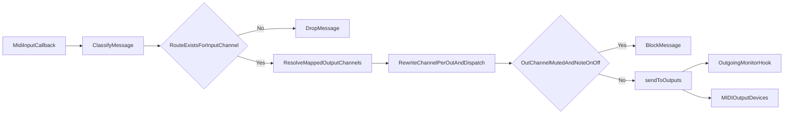
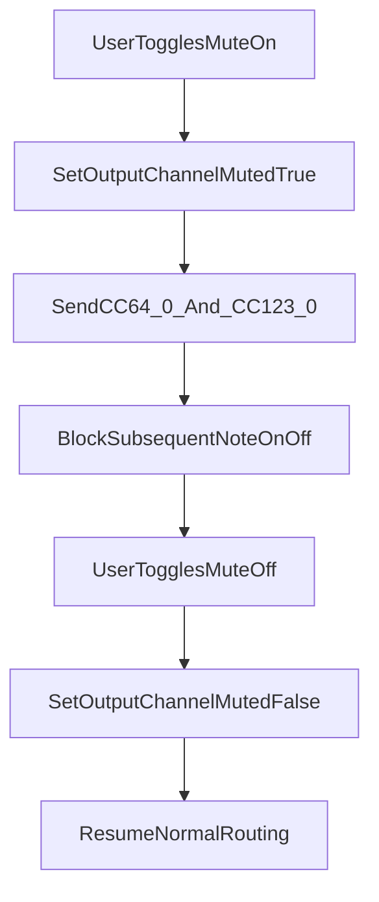

# AMidiOrgan Technical Overview

## 1. Purpose and Scope

`AMidiOrgan` is a JUCE-based C++ desktop application for live MIDI performance control. It sits between one or more MIDI input sources (keyboards/controllers) and one or more MIDI output destinations (hardware/software sound modules), and provides:

- Real-time voice assignment and effect editing
- Configurable channel/module routing and layering
- Preset recall and per-manual performance controls
- Runtime MIDI output monitoring
- Persistent panel/config/session/hotkey state

This document describes current implementation behavior and architecture as reflected in the active codebase.

## 2. High-Level Architecture

Primary implementation files:

- `Main.cpp`: Application startup and main window lifecycle
- `AMidiControl.h`: Main UI orchestration and tab/page logic
- `AMidiDevices.h`: MIDI I/O, routing, dispatch, and monitoring hook
- `AMidiInstruments.h`: Instrument and catalog model
- `AMidiButtons.h`: Button models/components with instrument metadata
- `AMidiRotors.h`: Rotary behavior and worker threads
- `AMidiUtils.h`: Shared constants, enums, app-state helpers, persistence utilities
- `AMidiHotkeys.h`: Hotkey binding model and persistence

### Architectural Layers

1. **UI Layer (Tabs/Pages)**  
   User interaction, view-state updates, and command dispatch.
2. **Domain/State Layer**  
   Button groups, voice buttons, instruments, presets, app session state.
3. **MIDI Transport Layer**  
   Input callback handling, routing decisions, output fan-out, mute gates, monitor tap.
4. **Persistence Layer**  
   Panel/config/hotkey/session files under `Documents/AMidiOrgan`.

## 3. Implemented Feature Inventory

### 3.1 UI Tabs and Capabilities

- **Start**
  - Select MIDI input/output devices
  - Load panel (`.pnl`) and config (`.cfg`)
  - Persist sticky MIDI ports
  - Restore last used panel/config on startup (`last_session.json`) when files exist
- **Upper / Lower / Bass&Drums**
  - Main performance tabs with voice button groups
  - Per-group volume and mute controls
  - Preset recall/write flows
  - Rotary controls on Upper/Lower with per-manual target selection between group 1 and group 2
  - Panel save/save-as
- **Sounds**
  - Two-level button browser (`Category -> Voice`) with pagination
  - Assign voice/instrument to selected button
  - Immediate audition via MSB/LSB/PC
  - Content border title includes module name when available
- **Effects**
  - Per-voice effect editing in real time
  - Sends CC updates on group output channel
  - Content border title includes module name when available
- **Config**
  - Button-group routing and behavior settings
  - Default effects values
  - Module alias fields
  - Validation rules for module/channel uniqueness
- **Hotkeys**
  - User-editable key mapping persisted to `hotkeys.json`
  - Duplicate key conflict prevention
  - Includes Monitor tab hotkey command
- **Monitor**
  - Outgoing MIDI monitor with enable/disable capture
  - History retention and clear action
  - Includes routed module name and current volume context
  - Virtual MIDI keyboard with octave control
- **Help**
  - In-app guide sourced from `assets/help.md`

### 3.2 Routing and MIDI Behavior

- Explicit route-map based forwarding (no implicit identity fallback)
- Support for output channel fan-out to multiple modules
- Defensive module/channel validation during config mapping
- Channelized non-note messages obey explicit routing decisions
- Output monitoring hook captures final routed messages

### 3.3 Mute and Safety Behavior

- Hard mute blocks **Note On and Note Off** on muted output channels
- On mute, sends:
  - `CC64=0` (Sustain Off)
  - `CC123=0` (All Notes Off)
- Does not send `CC7=0` as part of mute action

### 3.4 Usability and Risk Signaling

- Voice edit shortcut row enabled after explicit voice selection
- `Effects` shortcut button turns orange when selected voice has `VOL=0`, `EXP=0`, or `BRI=0` to indicate potential silence risk

## 4. Core Runtime Flows

### 4.1 MIDI In -> Route -> MIDI Out

Decision points:

- **RouteExistsForInputChannel**: Message is ignored when no explicit mapping exists.
- **ResolveMappedOutputChannels**: Fan-out is supported.
- **OutChannelMutedAndNoteOnOff**: Hard-mute gate blocks note traffic only.

### 4.2 Voice Selection and Edit Context

1. User clicks a voice button on Upper/Lower/Bass.
2. Selection is recorded as explicit and used for cross-tab edit context.
3. Voice Edit shortcuts become available.
4. Silence-risk check evaluates selected voice `VOL/EXP/BRI`.
5. Effects shortcut style updates (orange vs default).

### 4.3 Sounds Assignment

1. User opens Sounds for selected voice context.
2. Category list and voice list are browsed (paginated).
3. Selected voice updates voice-button instrument model.
4. App sends audition Program/Bank messages on mapped group channel.

### 4.4 Effects Editing

1. User opens Effects for selected voice context.
2. Existing per-voice effect values are loaded into controls.
3. Control changes emit CC updates on output channel.
4. Changes persist in panel state and survive save/reload.

### 4.5 Mute Lifecycle

### 4.6 Session Restore

1. Last session state is loaded early in top-level tab container construction.
2. Child pages initialize from restored app-state values.
3. On successful panel/config loads, session state is saved back to disk.

## 5. Domain Model Summary

### Key Concepts

- **Instrument**: Voice/program identity plus effect values
- **Voice Button**: Stores one instrument assignment and state
- **Button Group**: Routing and performance controls for a logical voice set
- **Panel**: Collection of groups/voices/presets across Upper/Lower/Bass
- **Config**: Routing and default behavior rules
- **AppState**: Current filenames/paths/session flags/shared runtime state
- **Manual rotary target**: Per-manual selector (`1` or `2`) mapping rotary routing to group 1 or group 2

### Data Constraints

- MIDI channels treated as `1..16`
- `(module, channel)` is the uniqueness key in config validation
- Same channel may be reused across different modules; duplicate module+channel is blocked

## 6. Persistence and File Layout

User data root: `Documents/AMidiOrgan`

- `configs/*.cfg`: Global routing/default behavior
- `panels/*.pnl`: Voice assignments and presets
- `configs/hotkeys.json`: Shortcut mappings
- `configs/midi_sticky_devices.json`: Last MIDI in/out selections
- `configs/last_session.json`: Last loaded panel/config
- `instruments/*.json`: Sound module catalogs

## 7. Threading and Runtime Considerations

- MIDI input callbacks may run off the UI thread.
- UI mutations should use message-thread-safe handoff patterns.
- Output path should stay low-latency and allocation-light.
- Monitor output buffering/flush should avoid heavy work in callback context.

## 8. Validation and Operational Quality

### Current Validation Types

- CMake/Xcode builds for app and tests
- Unit tests for routing and persistence behavior (`tests/test_main.cpp`)
- Manual UI smoke checks documented in `README.md`
- Security scanning (Snyk Code) used for change verification

### Regression-Sensitive Areas

- Routing map construction and module matching logic
- Muting and preset restore interactions
- Startup ordering for state restore vs page initialization
- Cross-tab selected-voice context and edit gating

## 9. Known Technical Risks / Improvement Opportunities

- `AMidiControl.h` centralizes substantial UI/orchestration logic; further modularization could lower coupling.
- Callback-to-UI boundaries require continued discipline to avoid latent thread issues.
- Additional monitor filtering/search/export could improve diagnostics at scale.
- A dedicated architecture folder (`docs/architecture/`) could separate user docs from technical design docs.

## 10. Recommended Companion Documents

For a fuller technical package, consider adding:

- **Sequence diagrams** for preset load/save and route-map rebuild
- **State machine doc** for mute/preset/selection transitions
- **Error matrix** for file/device/routing failures
- **Performance notes** (latency goals, expected message rates)

