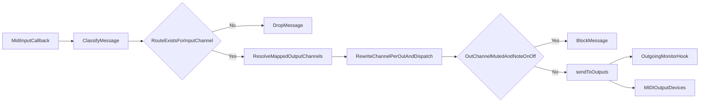
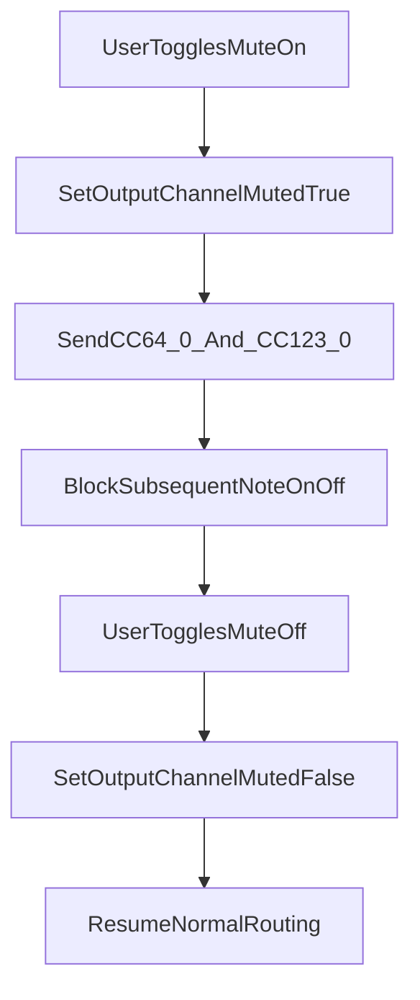
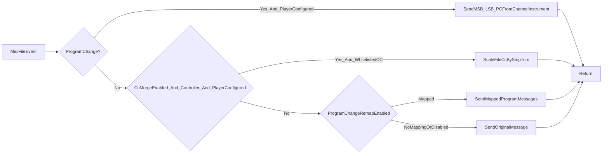

# AMidiOrgan Technical Overview

## 1. Purpose and Scope

`AMidiOrgan` is a JUCE-based C++ desktop application for live MIDI performance control. It sits between one or more MIDI input sources (keyboards/controllers) and one or more MIDI output destinations (hardware/software sound modules), and provides:

- Real-time voice assignment and effect editing
- Configurable channel/module routing and layering
- Preset recall and per-manual performance controls
- Runtime MIDI output monitoring
- Persistent panel/config/session/hotkey state

This document describes current implementation behavior and architecture as reflected in the active codebase.

## 2. High-Level Architecture

Primary implementation files:

- `Main.cpp`: Application startup and main window lifecycle
- `AMidiControl.h`: Main UI orchestration and tab/page logic
- `AMidiDevices.h`: MIDI I/O, routing, dispatch, and monitoring hook
- `AMidiInstruments.h`: Instrument and catalog model
- `AMidiButtons.h`: Button models/components with instrument metadata
- `AMidiRotors.h`: Rotary behavior and worker threads
- `AMidiUtils.h`: Shared constants, enums, app-state helpers, persistence utilities
- `AMidiHotkeys.h`: Hotkey binding model and persistence

### Architectural Layers

1. **UI Layer (Tabs/Pages)**  
   User interaction, view-state updates, and command dispatch.
2. **Domain/State Layer**  
   Button groups, voice buttons, instruments, presets, app session state.
3. **MIDI Transport Layer**  
   Input callback handling, routing decisions, output fan-out, mute gates, monitor tap.
4. **Persistence Layer**  
   Panel/config/hotkey/session files under `Documents/AMidiOrgan`.

## 3. Implemented Feature Inventory

### 3.1 UI Tabs and Capabilities

- **Start**
  - Select MIDI input/output devices
  - Load panel (`.pnl`) and config (`.cfg`)
  - Persist sticky MIDI ports
  - Restore last used panel/config on startup (`last_session.json`) when files exist
  - Quick `Exit` button in the Start action row (routes through the same flow as Exit tab)
  - Consolidated status lines rendered as `Panel: <file>` and `Config: <file>`
- **Upper / Lower / Bass&Drums**
  - Main performance tabs with voice button groups
  - Per-group volume and mute controls
  - Preset recall/write flows
  - Preset model: `Manual` plus numbered presets `1..12`
  - Banked preset display: six numbered preset buttons shown at a time (`1..6` or `7..12`)
  - `Next` cycle: `1 -> ... -> 6 -> 7 -> ... -> 12 -> 1`; from `Manual`, `Next` selects first preset in current bank
  - Rotary controls on Upper/Lower with per-manual target selection between group 1 and group 2
  - Panel save/save-as
- **Sounds**
  - Two-level button browser (`Category -> Voice`) with pagination
  - Optional live text search across all categories with dynamic `Search Results`
  - Search result buttons retain original `(categoryIdx, voiceIdx)` mapping
  - Assign voice/instrument to selected button
  - Immediate audition via MSB/LSB/PC
  - Content border title includes module name when available
- **Effects**
  - Per-voice effect editing in real time
  - Sends CC updates on group output channel
  - Per-voice octave transpose control (`-2..+2`) applied during note rewrite (no CC emission)
  - Content border title includes module name when available
- **Config**
  - Button-group routing and behavior settings
  - Default effects values
  - Module alias fields
  - Global startup-monitor toggle persisted in config
  - Global UI profile selector persisted in config (`uiProfileId`)
  - UI profile changes apply live across Start/Upper/Lower/Bass/Config/Sounds/Effects/Hotkeys/Monitor and resize the top-level app window
  - Profile catalog source: `Documents/AMidiOrgan/configs/ui_profiles.json`
  - Utility export action writes current keyboard control bounds to `ui_profile_overrides_<profileId>.json`
  - Global `Preset MIDI PC` trigger (`input channel` + `PC value`) persisted in config
  - Solo split note naming uses project convention `C4 = 60`
  - Validation rules for module/channel uniqueness
- **Hotkeys**
  - User-editable key mapping persisted to `hotkeys.json`
  - Duplicate key conflict prevention
  - Includes **Player tab**, Monitor tab hotkey commands, plus **Player Start/Stop** (defaults **`l`** Player tab / **`p`** Player transport in `HotkeyBindings::withDefaults`)
  - Preset hotkeys currently cover `Manual`, `Preset 1..6`, and `Next` (no dedicated `Preset 7..12` hotkeys yet)
- **Player**
  - MIDI-file playback (`MidiFilePlaybackEngine`) with timed event dispatch from file timestamps
  - Playback output uses **`MidiDevices::sendToPlayerModuleOnly(...)`** — matches only MIDI outputs mapped to `playerModuleIdx` (no implicit channel-route fan-out, no MidiView mirror duplication on file traffic)
  - `logPlayerOutputRoutingSummaryAtPlaybackStart()` records module name, matching output devices (`open` vs `closed`), and reinforces routing posture in logs
  - Per-channel (`1..16`) Player strips backed by `channelInstruments`
  - Per-strip output-channel override editor (`1..16`) next to each `Ch x` label; defaults to identity mapping
  - Program/Bank replacement on configured channels (`MSB`, `LSB`, `PC`), prior to CC merge + generic PC remap traversal
  - Optional Program Change lookup remap (`ProgramChangeRemapper`)
  - Optional CC merge against Player strip trims via `PlayerStripCcMerge::mergeControllerWithStripIfApplicable` when `midiPlayerSettings.enablePlayerStripCcScaling` is enabled
  - Transpose `-6…+6` semitones (note helper drops out-of-range after shift), BPM override remap (`0` keeps file tempo), playback start bar on Player UI/session only (not stored in profiles)
  - Start/Continue transport pair with `MidiFilePlaybackEngine`-backed cue position; **`Continue`** gated when no continuation state exists.
  - Per-strip **mute** bitmask + exclusivity **`solo`** gating handled in `PlayerPage::isPlaybackMutedForMessage(...)` using source/file channel semantics; solo toggles enqueue `sendAllNotesOff()` (All Notes Off + All Sound Off per channel) through the Player-only send path before persisting mute/solo data.
  - Final outbound channel rewrite happens in `PlayerPage::sendPlaybackMessage(...)` via `remapPlaybackMessageToOutputChannel(...)` after transpose and before Player-module send
  - Player playback mute gates are **orthogonal** to live button-group mute state (explicit decouple from Upper/Lower/Bass mute pipeline).
  - ValueTree-backed song profiles persist transpose, tempo override, mute/solo, remap/CC-merge booleans, module id, strips, per-strip output-channel overrides, and UI metadata
  - `Manage Profiles…` launcher edits sidecar catalogue + **`Load MIDI Profile`** restores referenced `.mid`; both list dialogs support live text filtering
  - Profile index + last-used mapping for auto-load on MIDI identity key
- **Monitor**
  - Dedicated **Incoming** (`midiIn`) and **Outgoing** (`midiOut`) text editors capped at **`kMonitorLineLimit = 50`** lines each; hitting the cap calls `stopMonitoringDueToLineLimit()` which lowers `monitorEnabled` and renders the Enable toggle **red/off** while `monitorStoppedForLineLimit` latch is set (`applyMonitorEnableButtonColours`).
  - Existing monitor hook drains queue on message thread respecting the same counters.
  - Optional startup auto-enable without tab navigation
  - Virtual MIDI keyboard respects tab-active gating (`setTabActive`); note labels follow `C4 = 60` convention aligned with Solo split editor
- **Help**
  - In-app guide sourced from `assets/help.md`

### 3.2 Routing and MIDI Behavior

- Explicit route-map based forwarding (no implicit identity fallback)
- Support for output channel fan-out to multiple modules
- Defensive module/channel validation during config mapping
- Channelized non-note messages obey explicit routing decisions
- Inbound channel-16 **CC** has a dedicated global-through fan-out path gated per button group (`globalCcThrough`)
- Incoming Program Change can trigger preset-next when it matches global config (`Preset MIDI PC`), using message-thread handoff to the hotkey-equivalent preset-next path
- Matched Program Change trigger events are consumed and not forwarded
- Player MIDI-file playback message order in `PlayerPage::timerCallback(...)`:
  - configured-channel Program Change replacement first
  - optional Player-strip CC merge second (selected controllers only)
  - optional generic Program Change remap lookup third
  - transpose + per-strip output-channel override right before Player-module send
  - default passthrough last
- Player profile auto-load order:
  - build MIDI identity key on file load
  - query profile index for matching entries
  - apply last-used profile when available
  - preserve current state when no profile exists
- Player profile-first load order (`Load MIDI Profile` button):
  - read selected profile from index/storage
  - resolve `midiRef.originalPath` and validate file existence
  - load MIDI file through normal `loadMidiFile(...)` path
  - apply selected profile state explicitly
- Output monitoring hook captures final routed messages
- Optional MidiView duplicate-send mirroring skips **Note On/Off** echoes when **Upper**, **Lower**, or **Bass&Drums** is active (`MidiDevices::setMidiViewEchoSuppressedForPerfKeyboardTabs`)
- When startup-monitor config is enabled, the outgoing monitor hook is armed during startup before Start-tab initialization completes

### 3.3 Mute and Safety Behavior

- Hard mute blocks **Note On and Note Off** on muted output channels
- On mute, sends:
  - `CC64=0` (Sustain Off)
  - `CC123=0` (All Notes Off)
- Does not send `CC7=0` as part of mute action

### 3.4 Usability and Risk Signaling

- Voice edit shortcut row enabled after explicit voice selection
- `Effects` shortcut button turns orange when selected voice has `VOL=0`, `EXP=0`, or `BRI=0` to indicate potential silence risk

## 4. Core Runtime Flows

### 4.1 MIDI In -> Route -> MIDI Out



Decision points:

- **RouteExistsForInputChannel**: Message is ignored when no explicit mapping exists.
- **ResolveMappedOutputChannels**: Fan-out is supported.
- **OutChannelMutedAndNoteOnOff**: Hard-mute gate blocks note traffic only.

### 4.2 Voice Selection and Edit Context

1. User clicks a voice button on Upper/Lower/Bass.
2. Selection is recorded as explicit and used for cross-tab edit context.
3. Voice Edit shortcuts become available.
4. Silence-risk check evaluates selected voice `VOL/EXP/BRI`.
5. Effects shortcut style updates (orange vs default).

### 4.3 Sounds Assignment

1. User opens Sounds for selected voice context.
2. Category list and voice list are browsed (paginated), or search text is entered for cross-category filtering.
3. Selected voice updates voice-button instrument model.
4. App sends audition Program/Bank messages on mapped group channel.

### 4.4 Effects Editing

1. User opens Effects for selected voice context.
2. Existing per-voice effect values are loaded into controls.
3. CC-backed controls emit updates on output channel; octave transpose updates voice note-rewrite state.
4. Changes persist in panel state and survive save/reload.

### 4.5 Mute Lifecycle



### 4.6 Session Restore

1. Last session state is loaded early in top-level tab container construction.
2. Child pages initialize from restored app-state values.
3. On successful panel/config loads, session state is saved back to disk.

### 4.7 Player MIDI-File Playback Rewrite Flow



Notes:

- CC merge applies only to: `CC1`, `CC7`, `CC11`, `CC71`, `CC72`, `CC73`, `CC74`, `CC91`, `CC93`.
- CC merge formula is `merged = clamp(round(fileValue * stripValue / 127.0))`.
- `CC10` (`Pan`) intentionally bypasses merge logic and remains passthrough.

## 5. Domain Model Summary

### Key Concepts

- **Instrument**: Voice/program identity plus effect values
- **Voice Button**: Stores one instrument assignment and state
- **Button Group**: Routing and performance controls for a logical voice set
- **Panel**: Collection of groups/voices/presets across Upper/Lower/Bass
- **Config**: Routing and default behavior rules
- **AppState**: Current filenames/paths/session flags/shared runtime state
- **Startup Monitor**: Config-persisted flag that auto-enables outgoing MIDI capture during startup without forcing the Monitor tab visible
- **Project note naming**: Shared octave convention where MIDI note `60` is displayed as `C4`
- **Manual rotary target**: Per-manual selector (`1` or `2`) mapping rotary routing to group 1 or group 2

### Data Constraints

- MIDI channels treated as `1..16`
- `(module, channel)` is the uniqueness key in config validation
- Same channel may be reused across different modules; duplicate module+channel is blocked
- Preset storage indices are `0..12` where `0=Manual`, `1..12=Preset 1..12`
- Preset-next Program Change trigger match uses `input channel 1..16` and `PC 0..127`

## 6. Persistence and File Layout

User data root: `Documents/AMidiOrgan`

- `configs/*.cfg`: Global routing/default behavior
- `panels/*.pnl`: Voice assignments and presets
- `configs/hotkeys.json`: Shortcut mappings
- `configs/midi_sticky_devices.json`: Last MIDI in/out selections
- `configs/last_session.json`: Last loaded panel/config
- `configs/midi_file_settings.json`: Player tab MIDI-file settings (autoload, remap, mute/solo, Player-strip CC merge toggle)
- `configs/player_profiles/`: Per-profile sidecar files (`<profileId>.playerprofile.json`)
- `configs/player_profiles_index.json`: Profile metadata index + `lastUsedByMidiKey`
- `configs/ui_profiles.json`: UI profile catalog and optional `keyboardRectOverrides`
- `configs/instrument_modules.json`: Managed module catalog (module index and metadata)
- `instruments/*.json`: Sound module catalogs

Config persistence notes:

- `Startup Monitor` is stored as a root-level config property, not per button group
- Missing property in older configs defaults to `false`
- Startup managed sync overwrites `configs/instrument_modules.json` and selected shipped instrument catalogs (`midigm.json`, `maxplus.json`, `integra7.json`, `at900mi.json`, `ketronevm.json`) each launch to keep runtime catalogs aligned with bundled docs.
- Non-managed user catalogs (for example `custom.json`) are preserved.
- Config root also persists `presetMidiPcInputChannel` and `presetMidiPcValue` for external Program Change preset-next triggering.
- Config root also persists `uiProfileId` for fixed-size profile selection.
- MIDI-file settings persist `enablePlayerStripCcScaling` (default `false` when missing for backward compatibility).
- Player profile schema root: `playerSongProfile` with `midiRef`, `moduleRef`, `playerFlags`, `channels`, and optional `uiState`; flags include transpose (`-6..6`), tempo override (`playbackTempoBpmOverride`), solo/mute bitmask, remap/CC-merge toggles. Channel entries also persist `outputChannel` (`1..16`). Legacy `playbackStartBar` in older saves is ignored; Bar is UI/session-only.
- Player profile schema is currently version `6`; missing/new properties continue to use defensive defaults for backward compatibility.
- Each `group` child also persists SysEx-through settings:
  - `sysexThrough` (bool, default `false`)
  - `sysexInputIdentifier` (MIDI input device identifier, default empty)
- Each `group` child also persists channel-16 CC global-through setting:
  - `globalCcThrough` (bool, default `false`)
- UI profile precedence:
  - explicit user `keyboardRectOverrides` from `ui_profiles.json` are used first;
  - built-in defaults are used as fallback only when profile overrides are absent.
- Panel preset payload compatibility:
  - New saves include `Manual + Preset 1..12`.
  - Loading remains backward compatible with legacy panel files containing only `Manual + Preset 1..6`; missing `Preset 7..12` nodes are default-initialized.

## 7. Threading and Runtime Considerations

- MIDI input callbacks may run off the UI thread.
- SysEx Through routing is resolved from a lock-protected snapshot (`input identifier -> output device indices`) and read from `MidiDevices::handleIncomingMidiMessage(...)` on the MIDI callback path.
- Channel-16 CC global-through is evaluated in `MidiDevices::handleIncomingMidiMessage(...)` for controller messages and routed using precomputed per-group metadata rebuilt by `ConfigPage::presetMidiIOMap()`.
- Global-through forwarding intentionally preserves channel `16` and allows duplicate device sends when multiple enabled groups share the same target output device.
- UI mutations should use message-thread-safe handoff patterns.
- Output path should stay low-latency and allocation-light.
- Monitor output buffering/flush should avoid heavy work in callback context.

## 8. Validation and Operational Quality

### Current Validation Types

- CMake/Xcode builds for app and tests
- Unit tests for routing and persistence behavior (`tests/test_main.cpp`)
- Manual UI smoke checks documented in `README.md`
- Security scanning (Snyk Code) used for change verification

### Build Metadata Update Semantics

Runtime metadata shown on the Start tab and in the window title uses two compile definitions:

- `AMIDIORGAN_PROJECT_VERSION`: sourced from `project(AMidiOrgan VERSION x.y.z ...)` in `CMakeLists.txt`.
- `AMIDIORGAN_BUILD_NUMBER`: sourced from the latest commit date at configure time (`git log -1 --format=%cd --date=format-local:%m/%d/%y`); falls back to configure UTC date (`string(TIMESTAMP ... "%m/%d/%y" UTC)`) if Git metadata is unavailable.

Update timing:

- `AMIDIORGAN_PROJECT_VERSION` changes only when the `VERSION` value in `CMakeLists.txt` is edited and rebuilt.
- `AMIDIORGAN_BUILD_NUMBER` refreshes when CMake configure runs; a plain `cmake --build ...` may reuse a previously configured date if no reconfigure is triggered.

To force-refresh the displayed build date before building:

```powershell
cmake -S . -B build
cmake --build build --config Release --target AMidiOrgan
```

### Regression-Sensitive Areas

- Routing map construction and module matching logic
- Explicit SysEx route resolution and unmapped-drop behavior
- Muting and preset restore interactions
- Startup ordering for state restore vs page initialization
- Cross-tab selected-voice context and edit gating
- MIDI monitor ingest path (dual 50-row caps, auto-stop hook, MidiView echo suppression interplay with routed sends)

## 9. Known Technical Risks / Improvement Opportunities

- `AMidiControl.h` centralizes substantial UI/orchestration logic; further modularization could lower coupling.
- Callback-to-UI boundaries require continued discipline to avoid latent thread issues.
- Additional monitor filtering/search/export could improve diagnostics at scale.
- A dedicated architecture folder (`docs/architecture/`) could separate user docs from technical design docs.

## 10. Recommended Companion Documents

For a fuller technical package, consider adding:

- **Sequence diagrams** for preset load/save and route-map rebuild
- **State machine doc** for mute/preset/selection transitions
- **Error matrix** for file/device/routing failures
- **Performance notes** (latency goals, expected message rates)

