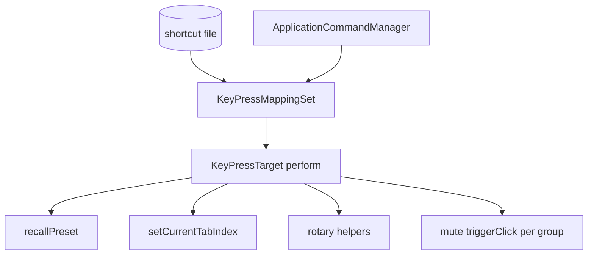

<!--
  Implementation plan snapshot — configurable hotkeys (presets, tabs, rotary, mute).
  Last synced from Cursor plan: preset_f-key_hotkeys (March 2026).
-->
---
name: Preset F-key hotkeys
overview: Add **user-configurable** shortcuts for **presets**, **menu tabs**, **Upper/Lower rotary** (4 actions), and **per–button-group mute toggles** (`numberbuttongroups` = 12), via `ApplicationCommandManager` + top-level `KeyListener`, persisted under `Documents/AMidiOrgan`. Ship **built-in defaults** when no shortcut file exists; delegate to existing UI (`triggerClick` / preset recall) so MIDI behavior stays identical.
todos:
  - id: default-shortcut-table
    content: "Define `getDefaultShortcuts()` (or equivalent) in code—non-conflicting KeyPress set; apply on first run when file missing; optionally write file immediately so defaults appear in JSON and user can edit."
    status: pending
  - id: keybind-model-persist
    content: "Binding model: presets 0–6, tabs 0–8, rotary×4, mute×12; single file; global conflict check; stable names; command ID ranges to avoid collisions (e.g. dedicated block for mute groups)."
    status: pending
  - id: apply-keymappings
    content: Register all command IDs; apply KeyMappings from file; perform() routes to preset + tab + rotary + mute handlers.
    status: pending
  - id: recall-helper
    content: "MenuTabs/KeyboardPanelPage: single loadPreset + sync preset radios; wire callback."
    status: pending
  - id: tab-switch-commands
    content: Tab indices 0–8 → setCurrentTabIndex; document Exit tab (quit flow).
    status: pending
  - id: rotary-commands
    content: Four rotary commands via KeyboardPanelPage helpers (same as button onClick).
    status: pending
  - id: mute-commands
    content: "For each button group index 0..11: command toggles InstrumentPanel::getButtonGroup(i)->getMuteButtonPtr()->triggerClick() with nullptr/enabled guards; bounds-check i; same path as clicking Mute on the keyboard page."
    status: pending
  - id: ui-rebind
    content: Config UI—presets, tabs, rotary, and 12 mute rows (label with group name if available); Assign/Clear/Reset; consider collapsible “Mute” section due to row count.
    status: pending
  - id: docs-test
    content: Document shortcuts; test persistence, conflicts, mute from any tab, rotary/mute edge cases.
    status: pending
isProject: false
---

# Preset + tab + rotary + mute hotkeys — user-configurable keys

## Feasibility (including “any key”)

**Yes** for **presets**, **menu tabs**, **rotary**, and **mute**. Same JUCE stack: `KeyPress` serialization, `KeyPressMappingSet`, top-level key listener in [`AMidiControl`](AMidiControl.h) (~8063–8068).

One shortcut file, **global** conflict checking across **all** bound actions (presets + tabs + rotary + mutes).

## Mute — UI and scope

The model has **`numberbuttongroups` = 12** ([`AMidiUtils.h`](AMidiUtils.h)). Each [`ButtonGroup`](AMidiControl.h) holds a pointer to a [`MuteButton`](AMidiControl.h) (`getMuteButtonPtr()` / `setMuteButtonPtr()`, ~363–370) wired when each [`KeyboardPanelPage`](AMidiControl.h) builds its groups (e.g. `g1tbmute` ~2743+).

**Hotkey behavior**: For group index `i` in `0 .. numberbuttongroups - 1`, the command should mirror **clicking that group’s Mute control**:

- Resolve `InstrumentPanel::getInstance()->getButtonGroup(i)` (or equivalent accessor already used elsewhere).
- If `getMuteButtonPtr()` is non-null and the button should accept input (same rules as UI—respect `isEnabled()` if relevant), call **`triggerClick()`** on that `MuteButton` so the existing `onClick` lambda runs (CC7, mute text, slider state, etc.)—**no duplicated MIDI**.

**Optional bindings**: Each of the 12 groups can have **zero or one** key; most users will bind only a subset.

**UX / Config UI**: Twelve rows is heavy; use a **collapsible “Mute (per group)”** section and show **group name** (`ButtonGroup::groupname`) next to each index so the mapping is understandable.

**Threading**: Hotkeys arrive on the message thread via `KeyListener`; `triggerClick()` stays UI-safe like other shortcuts in this plan.

## Rotary — (summary)

Four actions: Upper Fast/Slow, Upper Brake, Lower Fast/Slow, Lower Brake; Bass has no rotary widgets; respect `isrotary` / disabled state. See previous plan text in repo history if needed; full detail unchanged in spirit.

## Menu tabs — (summary)

Indices 0–8 including Exit (quit flow). Prefer cautious defaults for Exit.

## Recommended architecture

### 1. Binding model

- **Presets**: optional `0..6`.
- **Tabs**: optional `0..8`.
- **Rotary**: optional ×4.
- **Mute**: optional per **button group** `0 .. numberbuttongroups - 1` (12).
- **Conflicts**: validate across **all** categories.

### 2. Persistence

- Single file under `getOrganUserDocumentsRoot()` with sections e.g. `presets`, `tabs`, `rotary`, `mute` (object keyed by group index string), without altering `configs/` / `panels/` ([AGENTS.md](AGENTS.md)).

### 3. `perform()` routing

- Presets → recall helper.
- Tabs → `setCurrentTabIndex`.
- Rotary → `KeyboardPanelPage` helpers (Upper/Lower).
- Mute → `getButtonGroup(i)` + `getMuteButtonPtr()->triggerClick()` with guards.

### 4. UI

- Presets + tabs + rotary rows + **12 mute rows** (collapsible section recommended).

## Design constraints

1. **Presets** — Recall only when “Set” is off; never `savePreset` via hotkey.

2. **Exit tab** — Document powerful default.

3. **Rotary / mute** — Always delegate to existing controls; bounded indices for mute.

## Default bindings (first run)

**Yes — you can assign defaults for everything the feature exposes**, with two practical rules:

1. **Implementation** — Keep a **single in-code table** (e.g. `getDefaultShortcuts()`) that returns command ID → `KeyPress` (or description string). On startup: if the shortcut file is **missing or invalid**, apply defaults to `KeyPressMappingSet`, then **optionally write** the file so users see the same values on disk and can edit them. A **“Restore defaults”** button in Config reuses this same table.

2. **Design** — Defaults must be **pairwise non-conflicting** and should avoid high-risk keys (e.g. **no default** for the **Exit** tab unless you use a deliberate chord like Ctrl+Shift+Q). Twelve mute defaults plus presets + tabs + rotary fill the keyboard quickly; it is reasonable to default **mute to unbound** and document “assign in Config,” or use **numpad**-based defaults where a full set is desired (not all keyboards have a numpad).

**Example starting set (illustrative — tune during implementation):**

| Category | Suggested defaults | Notes |
|----------|--------------------|--------|
| **Presets 0–6** | `F1` … `F7` | Common, 7 distinct keys, no modifiers |
| **Tabs** | `Up` / `Left` / `Down` → Upper / Lower / Bass (tabs 1–3) | Matches existing [`KeyPressTarget`](AMidiUtils.h) intent for those three; add e.g. `Ctrl+1`…`Ctrl+6` for Start/Sounds/Effects/Config/Help only if they don’t clash with OS/editor |
| **Exit (tab 8)** | *None* | Avoid accidental quit |
| **Rotary ×4** | e.g. two-modifier chords (Ctrl+Shift+…) or **unbound** | F-keys already used by presets |
| **Mute ×12** | **Unbound** *or* numpad `1`…`9`, `0`, `+`, `-` if you want a full grid | Unbound is safest for first-time users |

Final defaults should be validated in-app with the **same global conflict check** used for user edits.

## Command ID allocation note

Existing small numeric IDs (`btnTabUpper` = 1, `btnUpperRotary` = 5, etc.) are tight. For **12 mute commands** plus other features, use a **dedicated ID range** (e.g. base + index) in [`KeyPressCommandIDs`](AMidiUtils.h) to avoid collisions and keep `perform()` switch/dispatch maintainable.

## Files to touch (summary)

| Area | File | Change |
|------|------|--------|
| Commands | [`AMidiUtils.h`](AMidiUtils.h) | Extended IDs + `KeyPressTarget` dispatch. |
| Persistence | helper | Sections include `mute`. |
| Wiring | [`AMidiControl.h`](AMidiControl.h) | Callbacks; mute via `InstrumentPanel` + `ButtonGroup`. |

## Validation

- Global duplicate-key rules across presets, tabs, rotary, mute.
- Mute hotkey with null mute pointer: no-op / log once in debug.
- Build per README.

## Open choices

- **Final** default table: confirm F1–F7 for presets, which chords for remaining tabs / rotary, and whether mutes ship unbound vs numpad.
- Whether to support a **single** “mute focused group only” shortcut later (not in initial scope unless requested).
